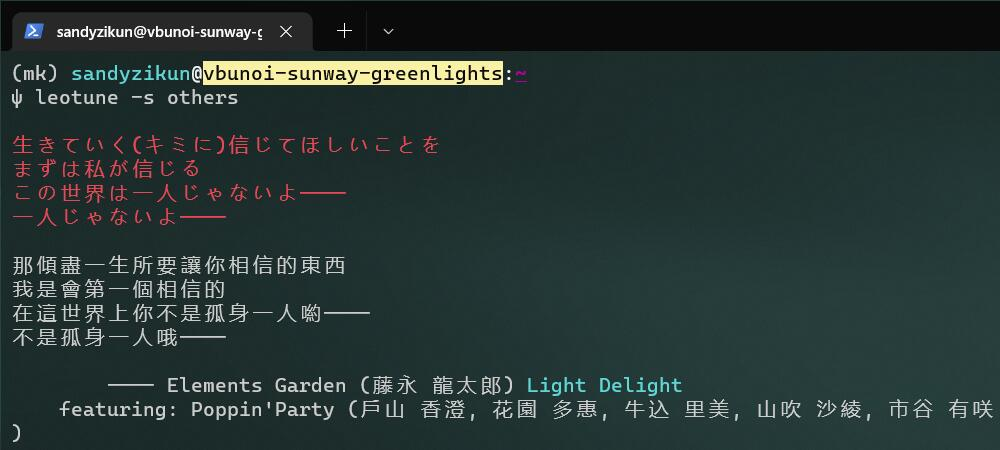

# `leotune`

A Simple Python-based CLI-tool throwing out lyrics of VOCALOID works, which is similar to `fortune`.


## Installation

Currently the latest version of `leotune` can be installed with `pip` as following:

```sh
$ pip install leotune --upgrade
```

or [from source](https://github.com/sandyzikun/leotune/) like other packages.

## Usage

`leotune` is designed as a CLI Tool, constructed as a `Python` module with an entry point, and can be called

* as a `Python` module:

  ```sh
  $ python -m leotune [--source SOURCE]
  ```

* by its entry point:

  ```sh
  $ leotune [--source SOURCE]
  ```

### Arguments

| Argument Name | Description |
|---------------|-------------|
| `-h`<br />`--help` | Show the help message |
| `--source SOURCE`<br />`-s SOURCE` | Select the source from which the lyrics are output |

For Instance,

```sh
$ leotune -s others

生きていく(キミに)信じてほしいことを
まずは私が信じる
この世界は一人じゃないよ----
一人じゃないよ----

那傾盡一生所要讓你相信的東西
我是會第一個相信的
在這世界上你不是孤身一人喲----
不是孤身一人哦----

        ---- Elements Garden (藤永 龍太郎) Light Delight
    featuring: Poppin'Party (戶山 香澄, 花園 多惠, 牛込 里美, 山吹 沙綾, 市谷 有咲
)
```

(Screenshot)


